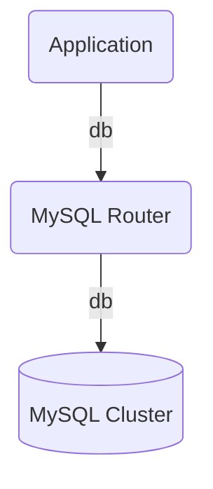

# mysql-router-k8s-operator

## Description

Charmed operator for mysql-router under k8s. MySQL-Router is a database proxy for Group Replicated MySQL clusters.

The proxy sit between the MySQL cluster and a client application, e.g.:



## Usage

This charm must be used coupled with mysql charm, through a relation, e.g.:

```bash
juju deploy mysql-k8s --trust
juju deploy mysql-router-k8s --trust
juju integrate mysql-k8s mysql-router-k8s
```

## Relations

Relations are defined in `metadata.yaml` are:

* Requires: db
* Provides: db

## OCI Images

Currently using the following OCI images:

* mysql-router: mysql/mysql-router:8.0

## Contributing

Please see the [Juju SDK docs](https://juju.is/docs/sdk) for guidelines on
enhancements to this charm following best practice guidelines, and
[CONTRIBUTING.md](https://github.com/canonical/mysql-router-k8s-operator/blob/main/CONTRIBUTING.md)
for developer guidance.
